# TetraSwarm

**A drone swarm that maps an unknown maze with onboard sensors, then cooperatively carries Tetris-shaped payloads through it — no overhead camera, no prior map.**

A MuJoCo simulation testbed for cooperative aerial robotics: a fleet of quadrotors
explores an unknown building with **camera + lidar fusion**, builds a shared
occupancy map, then lifts and delivers arbitrary tetromino payloads — a full
**perception → planning → control** pipeline. It also takes natural-language
commands, rotates wide payloads to squeeze through tight doorways, and estimates an
unknown payload's mass online.

<p align="center">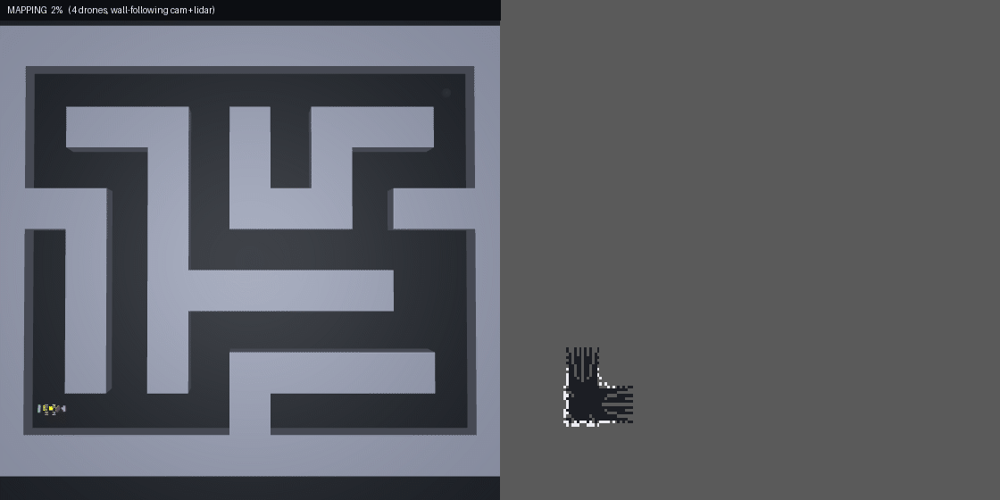</p>

> **The flagship mission (left: the maze, right: the live occupancy map).** Four
> drones start at a dock packed with 5 Tetris blocks, **map the unknown maze by
> wall-following with camera+lidar fusion** (~98%), compute the **furthest reachable
> corner**, then carry the blocks there one-by-one through the discovered corridors —
> placed side-by-side like Tetris, **0 wall contacts**.

---

## 1. Natural-language formations (LLM commander)

A Gemini-backed commander turns natural-language orders (*"arrange into a heart"*,
*"swirl into a fibonacci sunflower"*) into validated formations. The morph runs
through all 8 registry shapes — **circle → square → grid → vee → line → star →
heart → fibonacci** — with **vertical deconfliction** (each drone holds its own
altitude lane while crossing), so it stays collision-free in 3D, not just
non-overlapping in the top-down view.

<p align="center">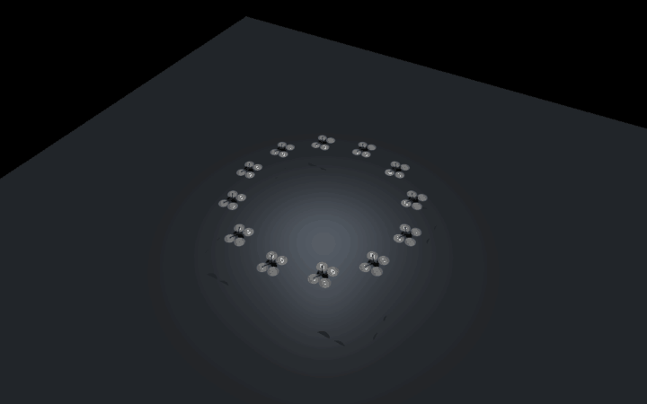</p>
<p align="center">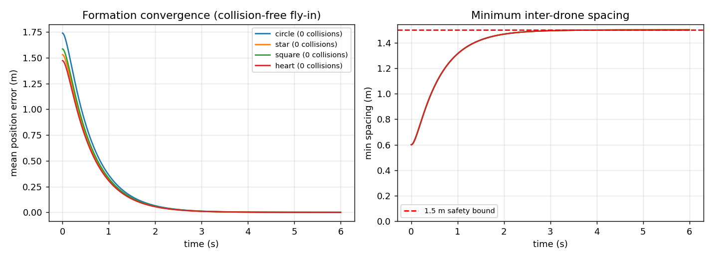</p>

## 2. The warehouse mission — map an unknown maze, then deliver

The drones know **nothing** about the building — no prior map, only onboard sensors
(the GIF at the top shows the full run).

**Mapping (camera + lidar fusion, reactive wall-following).** Each drone fuses a
**forward depth camera** (a dense reading of what's directly ahead) with its **360°
lidar** (the sides, and the long-range rays that build the map). Two drones follow
the **left** wall, two the **right**, so together they sweep the whole boundary. The
controller is deliberately simple and smooth — it **only turns, never backs off**:

- `front + left blocked → turn right`, `front + right blocked → turn left`
- dead-end → pivot in place and rotate out
- outside corner → a **forward-diagonal** ray rounds the corner only until the wall
  comes back into view (so the drones don't circle hunting for the wall)

The shared occupancy grid fills to **~98% in ~80 s**, then the swarm picks the
**geometric far corner** (the furthest reachable cell from the dock) and carries each
of the 5 blocks there along an **A\* route through the mapped corridors** — the solid
blocks log **0 wall contacts**, set down packed side-by-side like Tetris.

<p align="center">
  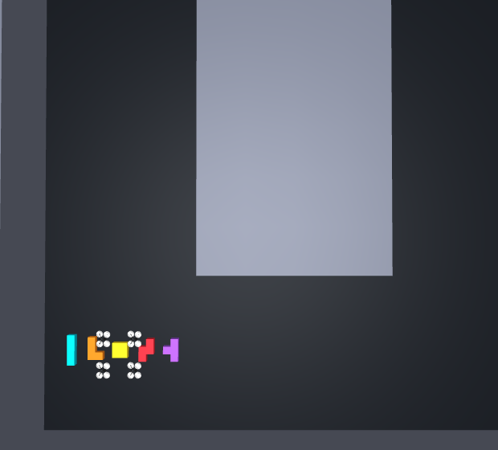
  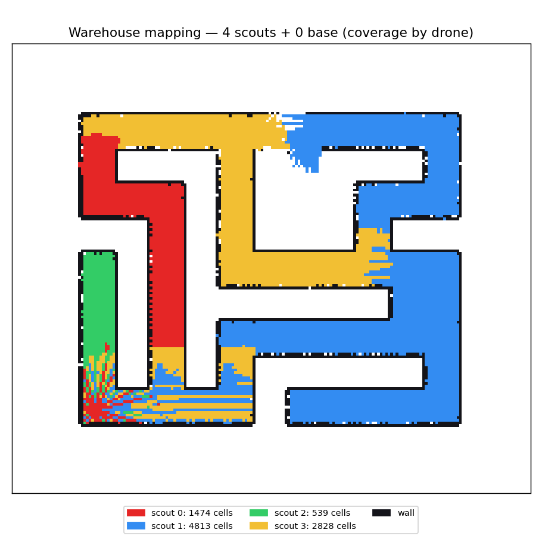
</p>

*Left: the dock — 5 Tetris blocks packed under the swarm at the start. Right: which
drone mapped which corridors (2 follow the left wall, 2 the right).*

<p align="center">
  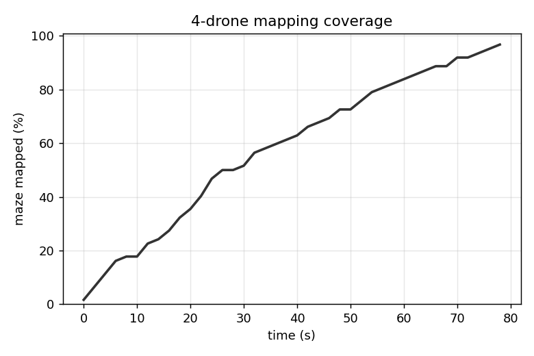
  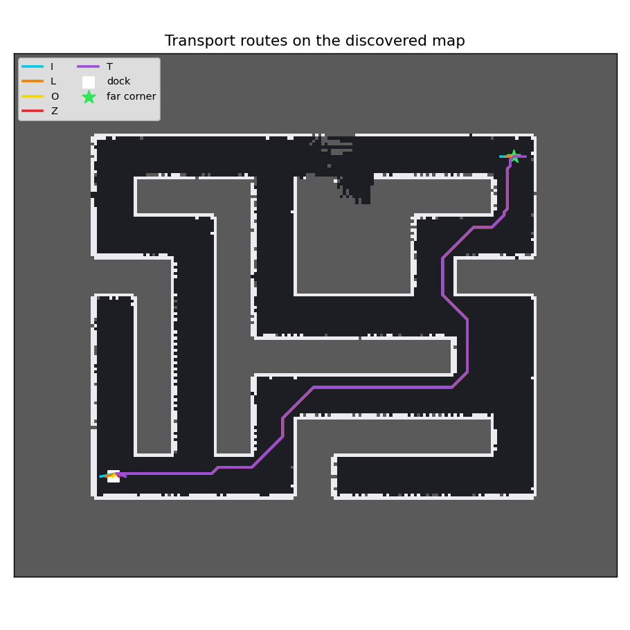
</p>

*Left: maze coverage vs time (~98% in ~80 s). Right: the A\* delivery routes on the
discovered occupancy map — dock to far corner, staying inside mapped corridors.*

```bash
python scripts/demo_warehouse.py            # headless, prints mapping % + delivery
python scripts/demo_warehouse.py --gif      # writes results/mission.gif + the figures above
```

## 3. Turn-to-fit (the piano-mover maneuver)

A wide slab can't fit a narrow doorway head-on, so the swarm **rotates it 90°** to
lead with its narrow side, then straightens out. The door is **solid** — too narrow
and it's physically blocked.

<p align="center">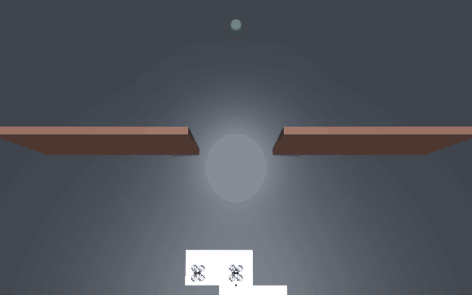</p>
<p align="center">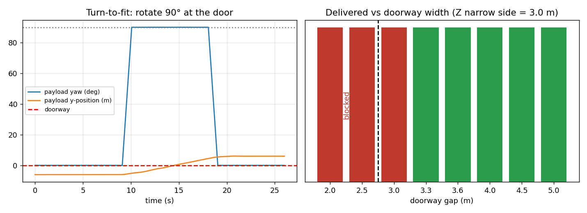</p>

## 4. Cooperative payload transport

`plan_transport` sizes the job — payload mass from geometry/density and the number of
carriers needed — then runs **approach → descend → suction-on → lift → carry** for any
tetromino:

<p align="center">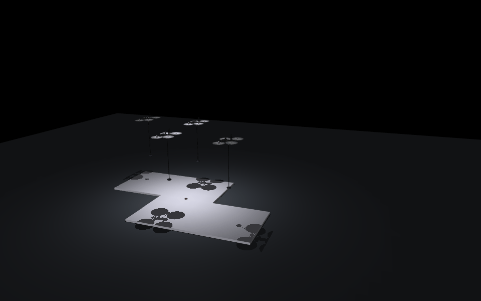</p>
<p align="center">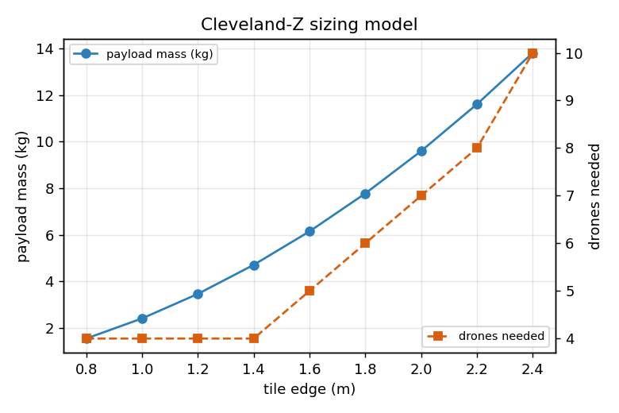</p>

*Mass and crew size scale with the payload tile size.*

## 5. Unknown payload — online mass estimation

The carriers are told **nothing** about the payload. An adaptive (MRAC-style)
feedforward grows online to cancel the unknown sag, so the per-drone shares — and the
total mass — are **estimated online**, tracking the true mass across shapes.

<p align="center">
  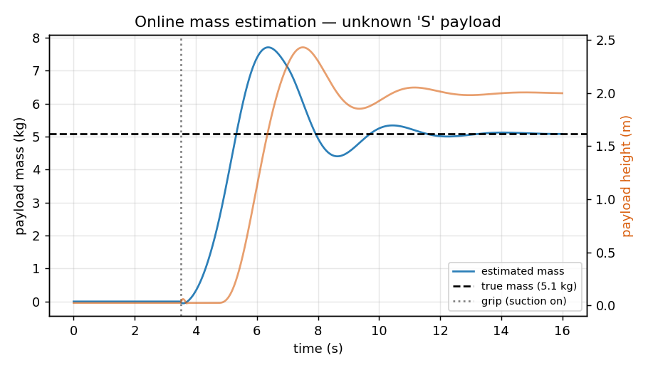
  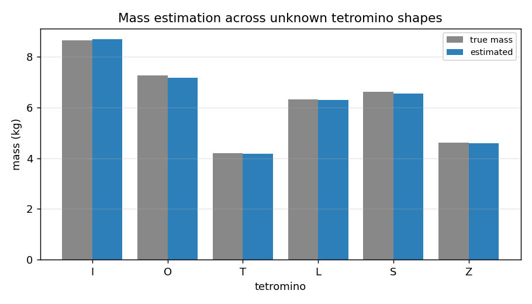
</p>

---

## Run it

```bash
pip install mujoco google-genai python-dotenv numpy scipy matplotlib pillow

python scripts/demo_warehouse.py --gif           # the flagship: map-then-deliver mission
python scripts/render.py morph --drones 12        # LLM formation morph
python scripts/demo_squeeze.py --gap 3.5          # turn-to-fit
python scripts/demo_transport.py --shape Z        # cooperative transport (mjpython on macOS for the viewer)
python scripts/demo_unknown.py --graphs           # unknown-payload estimation + graphs
python scripts/figures.py                         # research figures
```

## Architecture

```
envs/scene_builder.py       MJCF generators: PointMaze (warehouse), transport, squeeze
                            scenes + the braided-maze generator
control/pd_controller.py    force-based PD position control (+ feed-forward, force clamp)
control/adaptive.py         online mass estimation for unknown payloads
llm/formations.py           formation geometry + spacing + collision-free assignment
llm/commander.py            Gemini → validated formation command (offline keyword fallback)
scripts/demo_warehouse.py   the warehouse mapping + delivery mission (camera+lidar wall-following)
scripts/                    one demo per capability + render.py + figures.py
docs/                       design notes
```

## Honest scope

This is a **simulation testbed / engineering demonstration**, not a finished research
paper. Deliberate simplifications:

- The **depth camera** is a small offscreen MuJoCo render per drone; its median
  central depth is fused with the lidar for the front reading.
- The carry/transport is **kinematically driven** (drones + payload follow A\* routes
  through the *mapped* corridors) for clean, deterministic delivery — wall contacts
  are still detected and reported (the figure of merit is **0 contacts**).
- Suction is an idealized rigid `connect` constraint; the Skydio X2 is a visual mesh
  (no rotor-level thrust).

See `docs/` and the per-demo docstrings for details.

## Credits

Skydio X2 model from [MuJoCo Menagerie](https://github.com/google-deepmind/mujoco_menagerie).

## License

MIT for the TetraSwarm code (see `LICENSE`). The Skydio X2 model retains its own
upstream license.
