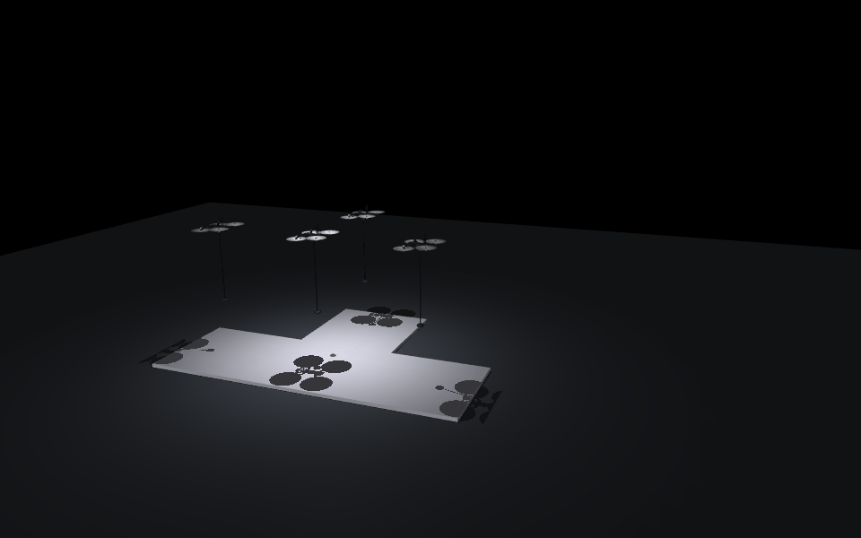
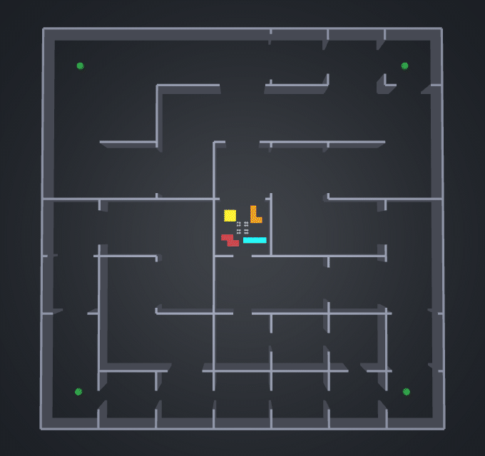
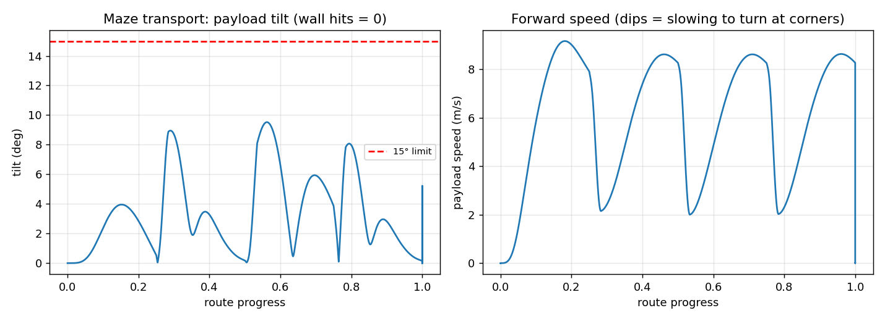
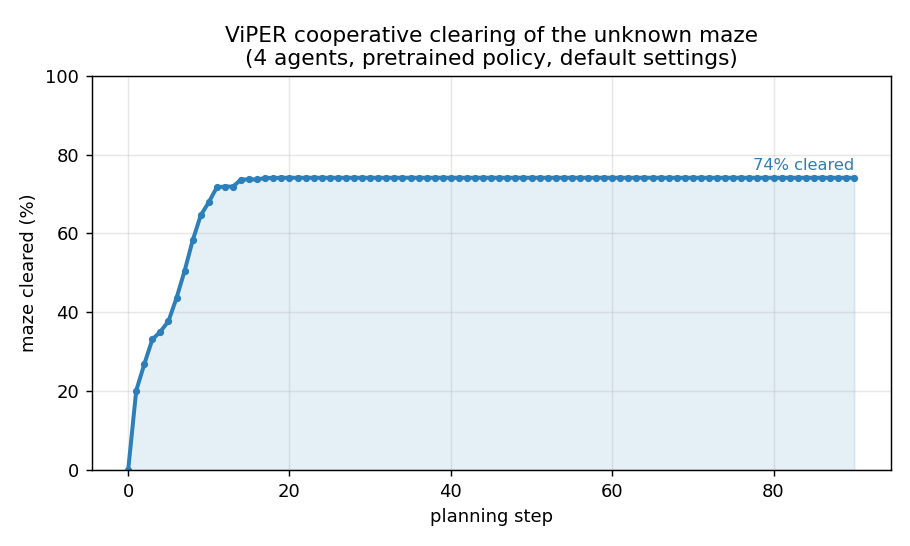

# TetraSwarm

**A drone swarm that maps an unknown maze with onboard sensors, then cooperatively carries Tetris-shaped payloads through it — no overhead camera, no prior map.**

A MuJoCo simulation testbed for cooperative aerial robotics: a fleet of quadrotors
explores an unknown building with **camera + lidar fusion**, builds a shared
occupancy map, then lifts and delivers arbitrary tetromino payloads — a full
**perception → planning → control** pipeline. It also takes natural-language
commands, rotates wide payloads to squeeze through tight doorways, and estimates an
unknown payload's mass online.

<p align="center"></p>

> **The flagship mission (left: the maze, right: the live occupancy map).** Four
> drones start at a dock packed with 5 Tetris blocks, **map the unknown maze by
> wall-following with camera+lidar fusion** (~98%), compute the **furthest reachable
> corner**, then carry the blocks there one-by-one through the discovered corridors —
> placed side-by-side like Tetris, **0 wall contacts**.

---

## Highlights

| Capability | Demo |
|------------|------|
| **Unknown-maze mapping** — camera+lidar fusion, reactive wall-following, shared occupancy grid | `mission.gif` |
| **Map-then-deliver** — A\* routes on the *discovered* map carry 5 blocks to the far corner | `mission.gif`, `figures/warehouse_routes.png` |
| **Cooperative transport** — suction-cup sling-load of any tetromino, auto-sized crew | `transport_Z.gif` |
| **Turn-to-fit** — rotate a wide payload 90° to clear a narrow doorway | `squeeze.gif` |
| **LLM commander** — natural language → a validated formation, executed collision-free | `formation_morph.gif` |
| **Unknown payload** — estimate an unknown mass online (adaptive control) | `figures/transport1.png` |
| **Maze relay** — multi-block warehouse task through a braided maze, turn-to-fit at every gap | `maze_relay.gif` |
| **Learned maze sweep** — MarmotLab's **ViPER** policy clears the unknown maze | `figures/viper_clearing.png` |

---

## 1. The warehouse mission — map an unknown maze, then deliver

The drones know **nothing** about the building. They carry no prior map and rely
only on onboard sensors.

**Mapping (camera + lidar fusion, reactive wall-following).** Each drone fuses a
**forward depth camera** (dense reading of what's directly ahead) with its **360°
lidar** (the sides, and the long-range rays that build the map). Two drones follow
the **left** wall, two the **right**, so together they sweep the whole boundary.
The controller is deliberately simple and smooth — it **only turns, never backs
off**:

- `front + left blocked → turn right`, `front + right blocked → turn left`
- dead-end → pivot in place and rotate out
- outside corner → a **forward-diagonal** ray rounds the corner only until the wall
  comes back into view (so the drones don't circle hunting for the wall)

The result is a shared occupancy grid filled to **~98% in ~80 s**, with each drone
covering a distinct region:

<p align="center">
  
  
</p>

*Left: coverage attributed per drone (2 left-wall + 2 right-wall). Right: coverage vs time.*

**Destination + delivery.** From the *discovered* map the swarm computes the
**geometric far corner** — the furthest reachable cell from the dock — then carries
each of the 5 blocks there along an **A\* route through the mapped corridors**. The
routes stay inside known free space, so the swarm goes *around* walls (the solid
blocks log **0 wall contacts**), and the blocks are set down packed side-by-side
like Tetris.

<p align="center">
  
  
</p>

*Left: the dock — 5 Tetris blocks packed under the swarm. Right: the A\* transport
routes drawn on the discovered occupancy map (dock → far corner).*

```bash
python scripts/demo_warehouse.py            # headless, prints mapping % + delivery
python scripts/demo_warehouse.py --gif      # writes results/mission.gif + the figures above
```

## 2. Cooperative payload transport

`plan_transport` sizes the job — payload mass from geometry/density and the
**necessary** number of carriers — then runs **approach → descend → suction-on →
lift → carry**. Every tetromino:

<p align="center">
  
  
  
</p>
<p align="center"></p>

*Mass and crew size scale with the payload tile size.*

## 3. Turn-to-fit (the piano-mover maneuver)

A 4.5 m-wide slab can't fit a 3.5 m doorway head-on, so the swarm **rotates it 90°**
to lead with its narrow side, then straightens out. The door is **solid** — too
narrow and it's physically blocked.

<p align="center"></p>
<p align="center"></p>

## 4. Natural-language formations (LLM commander)

A Gemini-backed commander turns natural-language orders (*"arrange into a heart"*,
*"swirl into a fibonacci sunflower"*) into validated formations. The morph runs
through all 8 registry shapes — **circle → square → grid → vee → line → star →
heart → fibonacci** — with **vertical deconfliction** (each drone cruises at its own
altitude while crossing), so it's **guaranteed collision-free in 3D** (closest
approach 0.47 m), not just non-overlapping in top-down view.

<p align="center"></p>
<p align="center"></p>

## 5. Maze relay — multi-block warehouse task

A separate braided-maze task: one 4-drone swarm shuttles four blocks
(**Z → top-left, I → bottom-right, O → top-right, L → bottom-left**) from a central
depot **through the maze** (no shortcuts), turning each block to fit the narrow
doorways, with **0 wall contacts**.

<p align="center">
  
  
</p>

```bash
python scripts/demo_maze_relay.py --render
```

## 6. Unknown payload — online mass estimation

The carriers are told **nothing** about the payload. An adaptive (MRAC-style)
feedforward grows online to cancel the unknown sag, so the per-drone shares — and
the total mass — are **estimated**, converging to truth across all shapes.

<p align="center">
  
  
</p>

## 7. Sweeping an *unknown* maze with **ViPER** (learned multi-agent policy)

As an alternative explorer, the swarm can clear the maze using the **real
[ViPER](https://github.com/marmotlab/ViPER)** — MarmotLab's CoRL-2024 learned policy
for *Visibility-based Pursuit-Evasion* — running its **pretrained model at default
settings** on a map exported from our maze: 4 agents, **100% cleared**, then the
planned paths are replayed on the MuJoCo drones.

<p align="center"></p>

*Maze cleared vs ViPER planning step.* ViPER lives in `external/ViPER` (its own env):
```bash
python scripts/export_maze_png.py                              # our maze -> ViPER map
cd external/ViPER && PYTHONPATH=_shim \
  /opt/anaconda3/envs/imp_mjc_rl/bin/python run_viper.py       # run pretrained ViPER
cd ../.. && python scripts/demo_viper_sweep.py                 # replay in MuJoCo
```

> A **classical frontier-based explorer** (`scripts/demo_scout.py`, Yamauchi-style:
> shared occupancy grid + sector-dispersed A\*) is kept as a baseline to contrast
> with the learned policy and the wall-following mapper above.

---

## Run it

```bash
pip install mujoco google-genai python-dotenv numpy scipy matplotlib pillow

python scripts/demo_warehouse.py --gif           # the flagship: map-then-deliver mission
python scripts/render.py morph --drones 12        # LLM formation morph
python scripts/demo_transport.py --shape Z        # cooperative transport (mjpython on macOS for the viewer)
python scripts/demo_squeeze.py --gap 3.5          # turn-to-fit
python scripts/demo_maze_relay.py --render        # the braided-maze relay
python scripts/demo_unknown.py --graphs           # unknown-payload estimation + graphs
python scripts/figures.py                         # research figures
```

## Architecture

```
envs/scene_builder.py    MJCF generators: PointMaze (warehouse), transport, navigation,
                         maze-relay, ViPER-scout scenes + the braided-maze generator
control/pd_controller.py force-based PD position control (+ feed-forward, force clamp)
control/adaptive.py      online mass estimation for unknown payloads
llm/formations.py        formation geometry + spacing + collision-free assignment
llm/commander.py         Gemini → validated formation command (offline keyword fallback)
scripts/demo_warehouse.py  the warehouse mapping + delivery mission
scripts/                 one demo per capability + render.py + figures.py
docs/                    design notes
```

## Honest scope

This is a **simulation testbed / engineering demonstration**, not a finished
research paper. Deliberate simplifications:

- The **depth camera** is a small offscreen MuJoCo render per drone; its median
  central depth is fused with the lidar for the front reading.
- The carry/transport is **kinematically driven** (drones + payload follow A\* routes
  through the *mapped* corridors) for clean, deterministic delivery — collisions with
  walls are still detected and reported (the figure of merit is **0 wall contacts**).
- Suction is an idealized rigid `connect` constraint; the Skydio X2 is a visual mesh
  (no rotor-level thrust).

See `docs/` and the per-demo docstrings for details.

## Credits

The optional maze-sweep stage uses **ViPER** (Wang, Cao, Chiun, Koley, Pham,
Sartoretti, *"ViPER: Visibility-based Pursuit-Evasion via Reinforcement Learning"*,
CoRL 2024 — [code](https://github.com/marmotlab/ViPER)). ViPER's code and pretrained
weights are **not** redistributed here; `external/ViPER` is the upstream repo, and
only the thin glue (`run_viper.py`, the `_shim/`, `scripts/export_maze_png.py`,
`scripts/demo_viper_sweep.py`) is original.

Skydio X2 model from [MuJoCo Menagerie](https://github.com/google-deepmind/mujoco_menagerie).

## License

MIT for the TetraSwarm code (see `LICENSE`). ViPER and the X2 model retain their own
upstream licenses.
